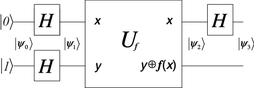

# Deutsch's Algorithm

### Background
David Deutsch attemps to show the differences of quantum computing and classical computing using the simplest possible algorithm

### Alogrithm
Given an oracle, a binary function f:{0,1}->{0,1}, find out if it is a constant function (gives all 0s or all 1s) or balance function (half the time 0 and half the time 1). It is possible to only invoke oracle once to verify the function using Quantum Parallelism.

### Quantum Circuit

#### |x,y> -> |x, y ⊕ f(x)>
The trick is to use XOR gate to construct a f-CNOT gate to test the function if it is a constant or balance one.

